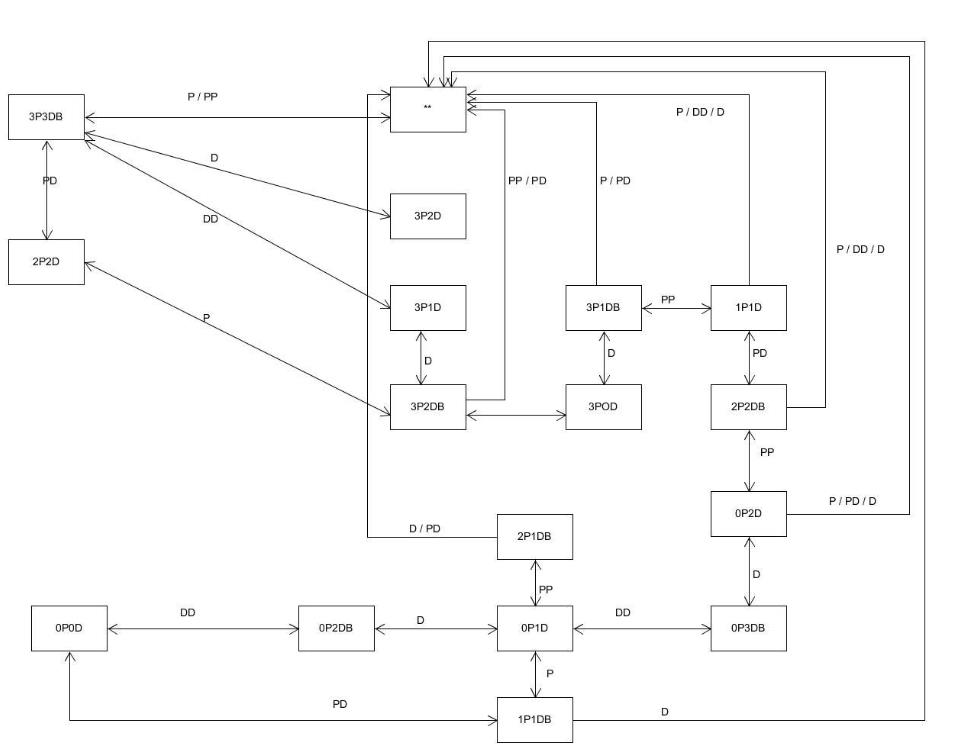

# 自动牧师与恶魔过河游戏

状态图如下：



实现状态图自动计算可以使用 BFS 算法，遍历每一个合法状态记录为点，而边则代表了动作，在程序中表示方法如下：

```csharp
public enum Action
{
    P,
    D,
    PP,
    PD,
    DD
}

public struct State
{
    public readonly int priestsOnLeft, devilsOnLeft, priestsOnRight, devilsOnRight, boat;
    public Dictionary<Action, State> nextStates, prevStates;
}

public class Policy
{
    public HashSet<State> validStates;
}
```

其中五个整数分别代表当前状态左边的牧师数、左边的恶魔数、右边的牧师数、右边的恶魔数以及船的位置。

而两个 Dictionary 则代表了这个状态的下一个状态如何到达以及上一个状态如何到达。

同时我们将成功路径上的所有的可能状态存放起来，到时候我们按照成功路径去查询下个状态即可。

演示视频地址：https://www.bilibili.com/video/av78171290/