如今云计算火热朝天，市面上有许多云桌面产品。你有没有想过自己也可以搭建一个云桌面平台呢？今天，就让我们一起试着用 VMware 来搭建自己的云桌面平台来玩玩吧！

## 云桌面的基本原理

云桌面听上去很高大上，但其实原理很简单：用户用远程桌面协议（例如 RDP 或者 VNC）连接到一台运行着操作系统的电脑上，而这个电脑通常是使用**虚拟化**技术虚拟出来的虚拟机。

## 安装 VMware Workstation

我们首先需要一个虚拟机软件来帮助我们新建虚拟主机，常用的有 VirtualBox 和 VMware Workstation。我使用的是 VMware Workstation。安装的过程很简单，只需要在网上下载安装包安装即可。由于已经安装过了，所以就不再展示安装过程了。

## 安装虚拟机操作系统

安装好虚拟机之后，就可以安装虚拟机上的操作系统了。我们可以安装 Windows、Linux、macOS 等等。安装可以到不同网站下载安装镜像，例如如果想安装 CentOS 的话，可以到 [https://mirrors.tuna.tsinghua.edu.cn](https://mirrors.tuna.tsinghua.edu.cn) 高速下载。

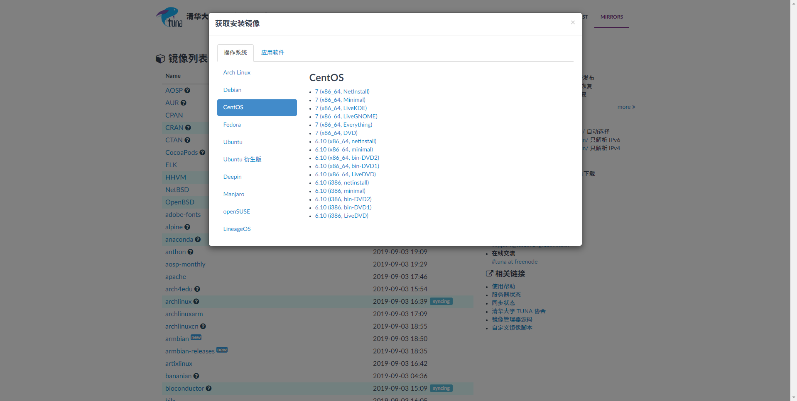

下载好 ISO 之后，到虚拟机软件中新建虚拟机：

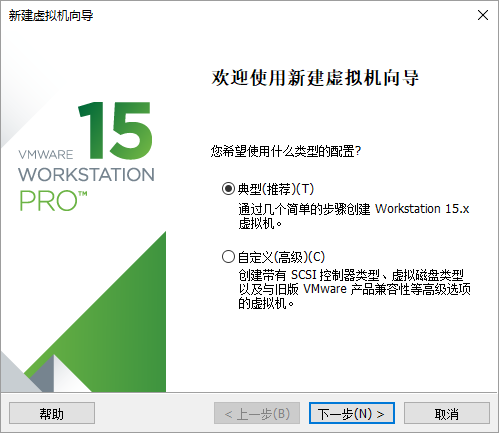

点下一步之后，选择刚刚下载的 ISO 文件：

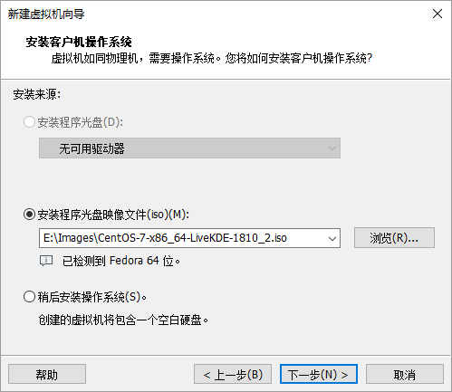

选择一个足够大的地方存放自己的虚拟机硬盘：

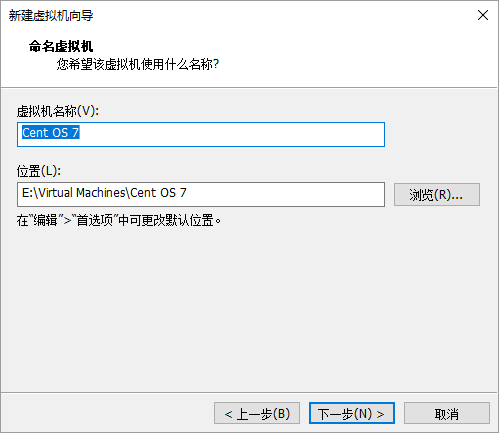

然后指定硬盘的大小，需要注意的是，如果事先不指定好足够大的容量，后期扩容会很麻烦，建议预留充足的磁盘空间：

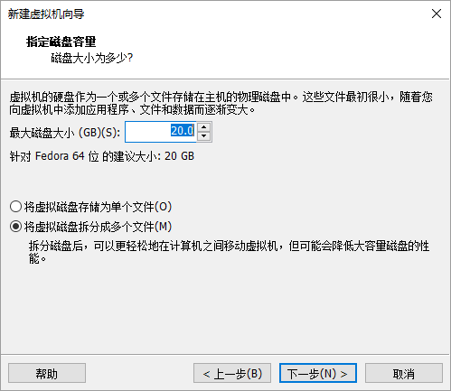

最后确认配置无误后，点击创建创建虚拟机：

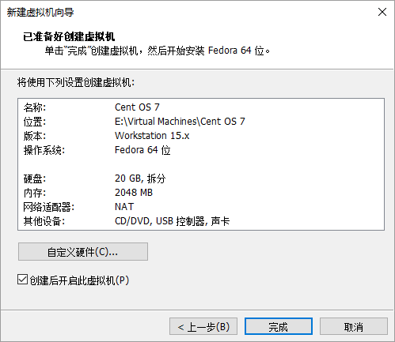

之后按照不同操作系统的安装指南进行安装即可。

## 配置虚拟机网络

在虚拟机设置中，确认有网络适配器是 NAT 模式，否则虚拟机无法上网。

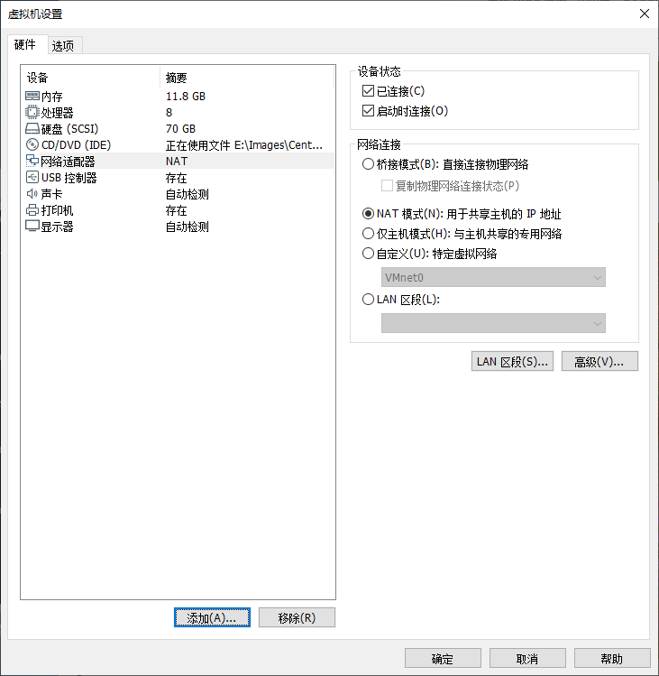

在 VMware Workstation 的“编辑”菜单中选择“虚拟网络编辑器”：

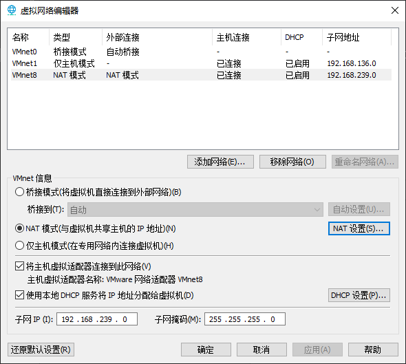

检查 NAT 网卡连接到了主机上。

进入操作系统，尝试连接外网，并查看网卡的 IP：

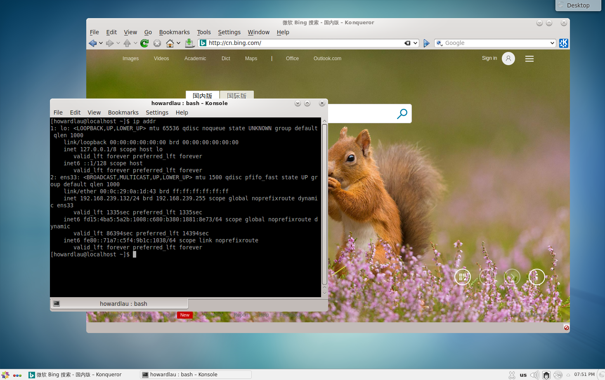

在宿主机上使用 SSH 尝试连接：

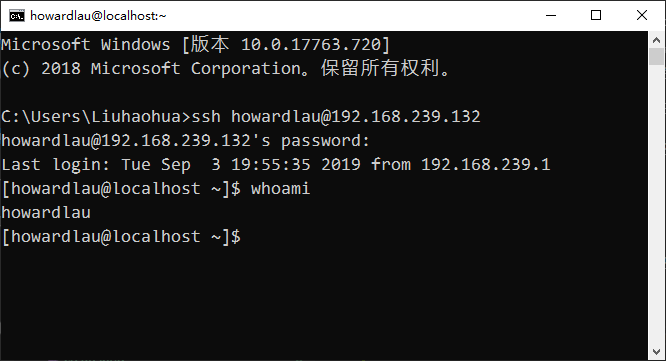

可以看到虚拟机既能连接外网，又可以和宿主机通信。

## 开启 VNC 连接

在虚拟机设置中，开启虚拟机的 VNC 连接，如果想安全一些，可以启用 VNC 连接密码：

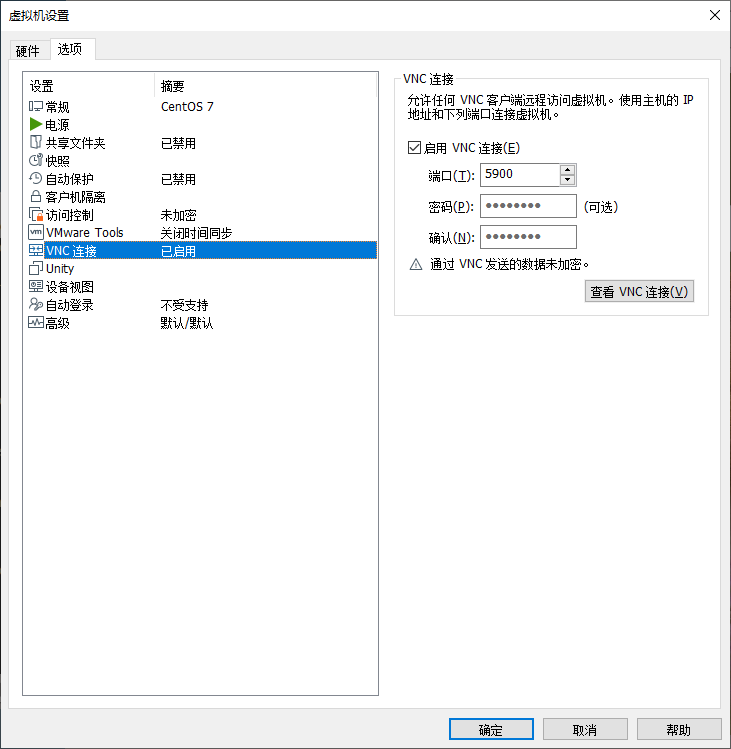

设置好之后，其他人就可以通过你电脑的 IP 地址来访问你创建的虚拟机了。

到网络和共享中心查看自己的网卡 IP：

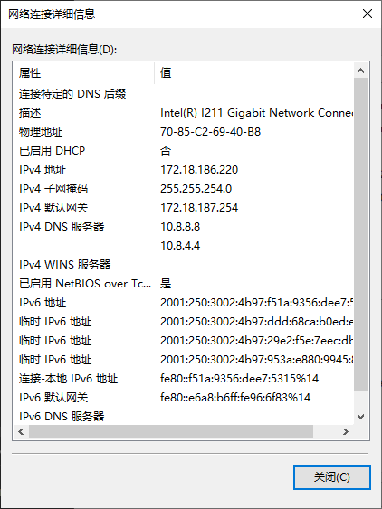

然后让想使用云桌面的用户下载 [RealVNC 客户端](https://www.realvnc.com/en/connect/download/viewer/)。安装好之后使用你电脑的 IP 地址和端口号连接虚拟机：

看到操作系统界面之后就宣布大功告成啦！只要你的电脑和虚拟机一直运行着，别人就可以一直使用你的云桌面服务。是不是觉得云计算也没有那么神秘呢？

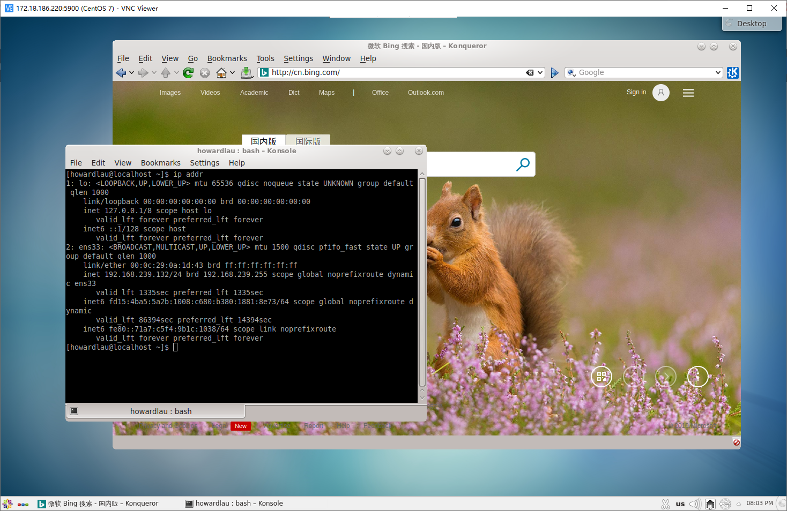

当然，你还可以安装其他的操作系统，只要你的电脑足够强大，就可以同时为许多人提供云桌面服务！

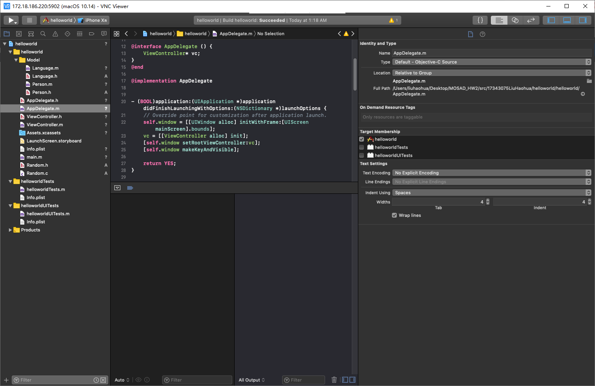

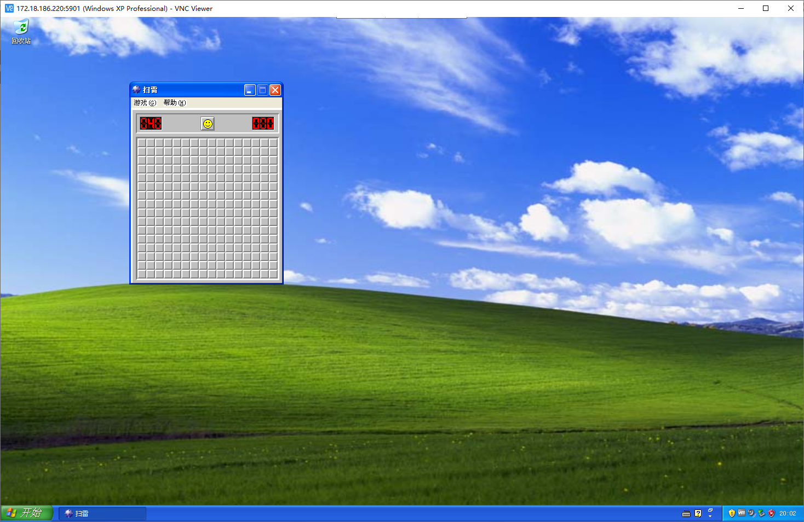

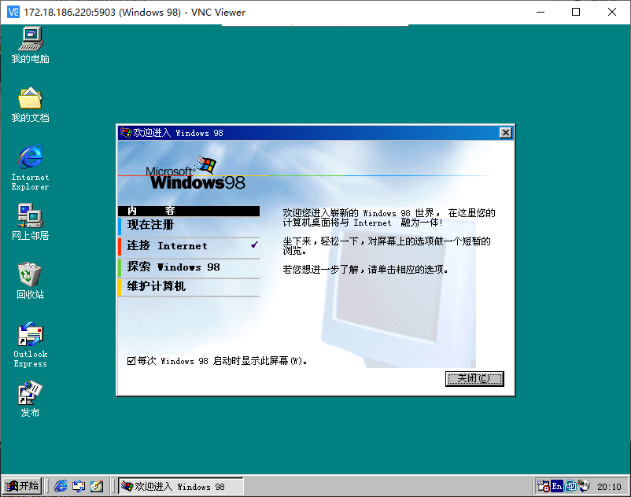
